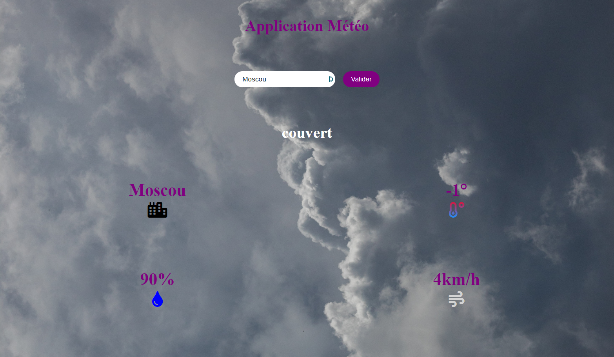

# Mon application météo
Application météo réaliser en Javascript avec appel API au site https://openweathermap.org.
Technologies: Html, Css, Js, Joi(validation de données), Browserify(bundle), Watchify.  

## Mise en place de l'application
Créé un env.js à la racine du dossier avec une variable apiKey qui aura en valeur  votre clef API et exporter cette variable.  
Pour que cette variable soit exportable et requise dans un autre fichier nous avons besoin d'utiliser un bundler(browserify). Lancez dans votre terminal la commande "browserify -e app.js -o dist/bundle.js" pour la gestion des fichiers et de leurs lien(export, require).

Une fois ces manipulations effectuées vous pouvez utiliser cette application en local.  
____

____

____

